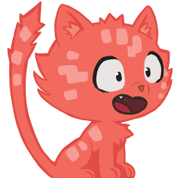

# What we're building

The pallet we're building is based on the well known [ERC721 standard](https://eips.ethereum.org/EIPS/eip-721).
Our pallet is pretty much analagous.
But we're going to build a **specific type of NFT representing the DNA of a collectable Kitty.** 
It'll show how we're able to build some NFT-like standard and tell a well known story around it, the CryptoKitties story. 

Here are some of the ERC721 features our pallet will have: 

* `function ownerOf(_tokenId)-> address`: returns the address of the owner of the NFT. 
    * We'll use a storage item that maps a kitties DNA to a kitty struct that contains the owner. 
* `function tokenByIndex(_index)`: returns the identifier for an NFT at some index.
* `function balanceOf(_owner)-> uint256`: returns the number of NFTs owned by `_owner`.
* `function tokenOfOwnerByIndex(_owner, _index)`: returns the identifier of the NFTs assigned to some owner.
    * We'll use a storage item that keeps track of the kitties owned by an account.
* `function totalSupply()`: returns the total supply of existing NFTs.
    * We'll use a storage item that keeps track of the total count of kitties in existence.

With pallets,  we're able to customize and extend the logic of our NFT application in so many ways.. 
Extra points to those of you who create the Bufficorn front-end for the chain we're building! 🦬🦄

<!-- slide:break-40 -->

## How our pallet's unique DNA works

Our pallet will create a unique DNA that can be used to map features specific to some collectable rendered by an application-specifc front-end.
DNA is represented by a `[u8; 16]` (an array of 16 bytes) that could look like this:

`[52, 12, 44, 54, 52, 12, 44, 54, 52, 12, 44, 54, 52, 12, 44, 54]`

where each byte can be mapped to a specific feature. 

At the end of this workshop, we'll run our blockchain and interact with it using the Kitties front-end so we can show how our pallet can generate truly unique Kitties!
## What we won't cover

* Writing tests for our pallet
* Assigning correct weights for our pallet's dispatchable 
* Writing the front-end application 
